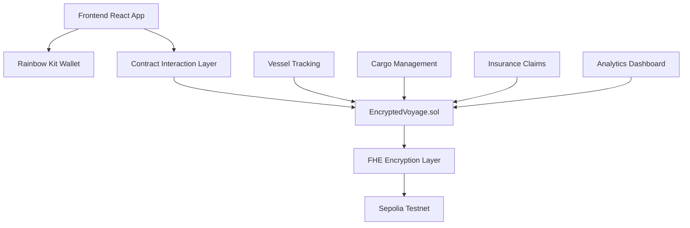

# 🌊 Encrypted Voyage Contracts

> **Revolutionary Maritime Logistics with Fully Homomorphic Encryption**

[](https://opensource.org/licenses/MIT)
[](https://www.typescriptlang.org/)
[](https://reactjs.org/)
[](https://vitejs.dev/)

## 🚢 Overview

**Encrypted Voyage Contracts** is a cutting-edge decentralized application that revolutionizes maritime logistics through the power of Fully Homomorphic Encryption (FHE). Built for the modern shipping industry, it enables secure, privacy-preserving cargo tracking and logistics management while maintaining complete data confidentiality.

### ✨ Key Features

- 🔐 **FHE-Encrypted Data Processing** - Process sensitive logistics data without exposing it
- 🚢 **Real-time Vessel Tracking** - Secure tracking with encrypted location data
- 📦 **Smart Cargo Management** - Encrypted cargo information and status updates
- 🛡️ **Privacy-Preserving Analytics** - Analyze logistics patterns without compromising data
- 🌐 **Multi-Chain Support** - Compatible with Ethereum and other EVM chains
- 💼 **Insurance Integration** - Encrypted insurance claims and damage assessments
- ⭐ **Reputation System** - Trust scoring for vessels and operators

## 🏗️ Architecture



## 🛠️ Technology Stack

### Frontend
- **React 18** - Modern UI framework
- **TypeScript** - Type-safe development
- **Vite** - Lightning-fast build tool
- **Tailwind CSS** - Utility-first styling
- **shadcn/ui** - Beautiful component library

### Blockchain & Encryption
- **Solidity** - Smart contract development
- **FHEVM** - Fully Homomorphic Encryption
- **Wagmi** - React hooks for Ethereum
- **Rainbow Kit** - Wallet connection framework
- **Viem** - TypeScript interface for Ethereum

### Infrastructure
- **Sepolia Testnet** - Ethereum test network
- **Vercel** - Deployment platform
- **GitHub Actions** - CI/CD pipeline

## 🚀 Quick Start

### Prerequisites

- Node.js 18+ 
- npm or yarn
- Git
- MetaMask or compatible wallet

### Installation

1. **Clone the repository**
   ```bash
   git clone https://github.com/chainhunter33/encrypted-voyage-contracts.git
   cd encrypted-voyage-contracts
   ```

2. **Install dependencies**
   ```bash
   npm install
   ```

3. **Configure environment**
   ```bash
   cp .env.example .env
   # Edit .env with your configuration
   ```

4. **Start development server**
   ```bash
   npm run dev
   ```

## ⚙️ Configuration

### Environment Variables

Create a `.env` file with the following configuration:

```env
# Network Configuration
VITE_CHAIN_ID=11155111
VITE_RPC_URL=https://sepolia.infura.io/v3/YOUR_INFURA_KEY
VITE_WALLET_CONNECT_PROJECT_ID=YOUR_PROJECT_ID

# Contract Address (deploy first)
VITE_CONTRACT_ADDRESS=0x...

# FHE Configuration
VITE_FHE_NETWORK_URL=https://api.zama.ai
VITE_FHE_APP_ID=your_app_id
```

### Smart Contract Deployment

1. **Compile contracts**
   ```bash
   npx hardhat compile
   ```

2. **Deploy to Sepolia**
   ```bash
   npx hardhat run scripts/deploy.js --network sepolia
   ```

3. **Update contract address**
   ```bash
   # Update VITE_CONTRACT_ADDRESS in .env
   ```

## 📱 Usage

### Creating a Voyage

1. **Connect Wallet** - Use Rainbow Kit to connect your wallet
2. **Create Voyage** - Fill in vessel and cargo details
3. **Encrypt Data** - Sensitive information is automatically encrypted
4. **Track Progress** - Monitor voyage status in real-time

### Managing Cargo

- **Add Cargo** - Register cargo with encrypted weight/value data
- **Update Status** - Track cargo condition and location
- **Generate Reports** - Create encrypted analytics reports

### Insurance Claims

- **Submit Claims** - File encrypted insurance claims
- **Damage Assessment** - Encrypted damage evaluation
- **Approval Process** - Secure claim verification

## 🔒 Security Features

### FHE Encryption
- **Zero-Knowledge Processing** - Compute on encrypted data
- **Privacy-Preserving Analytics** - Analyze without exposing data
- **Secure Multi-Party Computation** - Collaborative analysis

### Smart Contract Security
- **Access Control** - Role-based permissions
- **Data Validation** - Input sanitization and verification
- **Audit Trail** - Immutable transaction history

## 🧪 Testing

### Run Tests
```bash
# Unit tests
npm run test

# Contract tests
npx hardhat test

# E2E tests
npm run test:e2e
```

### Test Coverage
```bash
npm run test:coverage
```

## 📦 Deployment

### Vercel Deployment

1. **Connect Repository**
   - Import project in Vercel dashboard
   - Configure build settings

2. **Set Environment Variables**
   - Add all required environment variables
   - Configure for production environment

3. **Deploy**
   - Automatic deployment on push to main
   - Manual deployment available

### Custom Domain
- Configure DNS settings
- SSL certificate automatically provided
- HTTPS enabled by default

## 🤝 Contributing

We welcome contributions! Please see our [Contributing Guide](CONTRIBUTING.md) for details.

### Development Workflow

1. **Fork Repository**
2. **Create Feature Branch**
3. **Make Changes**
4. **Add Tests**
5. **Submit Pull Request**

## 📄 License

This project is licensed under the MIT License - see the [LICENSE](LICENSE) file for details.

## 🆘 Support

- **Documentation** - [docs.encryptedvoyage.com](https://docs.encryptedvoyage.com)
- **Issues** - [GitHub Issues](https://github.com/chainhunter33/encrypted-voyage-contracts/issues)
- **Discord** - [Community Discord](https://discord.gg/encryptedvoyage)
- **Email** - support@encryptedvoyage.com

## 🗺️ Roadmap

### Phase 1 - Core Features ✅
- [x] FHE-encrypted smart contracts
- [x] Wallet integration
- [x] Basic cargo tracking
- [x] Insurance claims

### Phase 2 - Advanced Features 🚧
- [ ] Multi-chain support
- [ ] Advanced analytics
- [ ] Mobile application
- [ ] API integration

### Phase 3 - Enterprise 🎯
- [ ] Enterprise dashboard
- [ ] Custom integrations
- [ ] Advanced security features
- [ ] Compliance tools

## 🙏 Acknowledgments

- **Zama** - FHE technology and support
- **Rainbow** - Wallet connection framework
- **Vercel** - Deployment platform
- **OpenZeppelin** - Security standards

---

<div align="center">

**Built with ❤️ by the Encrypted Voyage Team**

[Website](https://encryptedvoyage.com) • [Documentation](https://docs.encryptedvoyage.com) • [Twitter](https://twitter.com/encryptedvoyage)

</div>